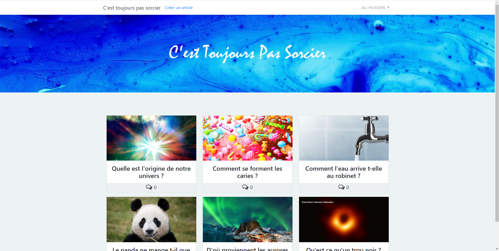
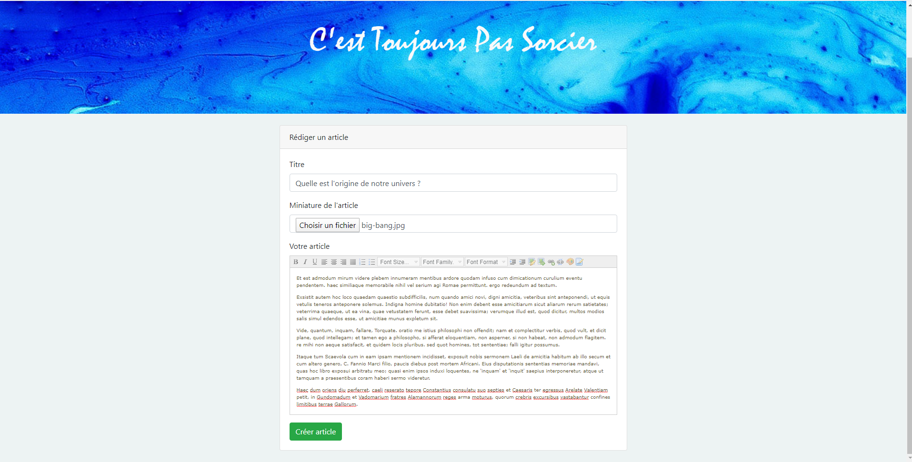
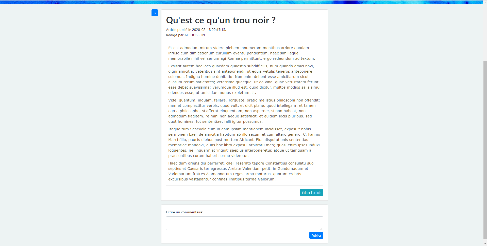
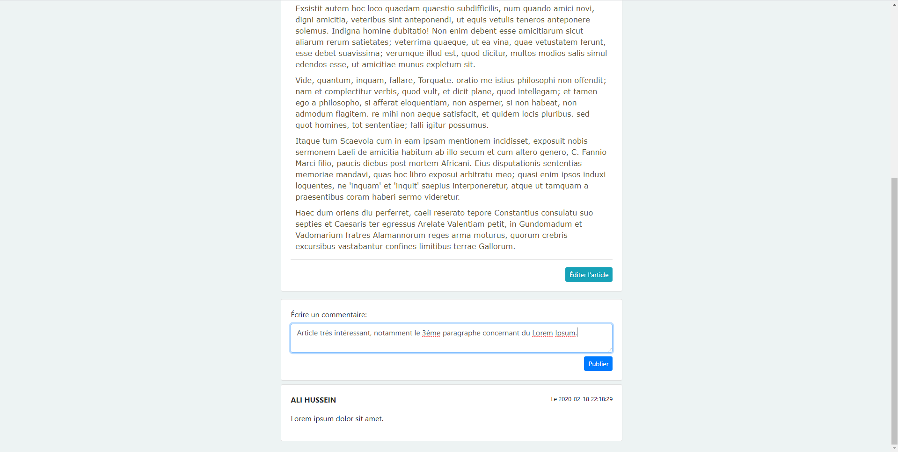

# Projet de Webzine / site d'articles scientifiques

Le projet part initialement d'une consigne d'exercice, supposé réalisé un .pdf d'un faut Webzine.

Finalement il fut convenu de réaliser, à l'aide de Laravel, un réel site web sur lequel il sera possible de rédiger des articles scientifiques, de créer un compte avec de poster des commentaires, d'ajouter des anecdotes et petites phrases d'accroches sporadiques à travers l'interface du Webzine afin de susciter l'intérêt des lecteurs sur certains domaines et catégories.

D'une manière plus globale, ce projet s'ancre dans une volonté de reprendre les codes de la fameuse émission "C'est pas sorcier" sous format Webzine, à savoir vulgariser dans un court format certains faits et anecdotes scientifiques qui sont soit peu connues mais très intéressantes, soit très connues du grand public mais mal ou pas comprises.
(Ex.: Qu'est ce qu'un trou noir ? / Comment l'eau du robinet arrive t-elle aux étages sans électricité ? / Déconstruire certains mythes et idées reçues).

## Stade d'avancement du projet

Le projet au sens scolaire n'étant que celui de la réalisation d'un Webzine de quelques articles rédigés, le groupe mis en place certaines fonctionnalités annexes, bonne occasion de s'entraîner et s'améliorer aux différentes technologies du Web vues par certains des membres du groupe (Ali Hussein et Valentin Do Espirito Santo), telles que l'HTML/CSS, Laravel, PHP, Javascript ou encore Bootstrap.

Ainsi, au niveau des fonctionnalités actuelles:

`→ Page d'accueil du site (avec ou sans session de connexion):`

`→ Rédaction d'un article avec ajout de sa miniature:`

`→ Affichage de l'article pour un lecteur (ici le lecteur est aussi connecté en tant que rédacteur de l'article, le bouton d'édition de l'article s'affiche donc).`

`→ Publication d'un commentaire sous l'article + affichage des commentaires déjà présents en lien avec ledit article.`

## Fonctionnalités à venir

Ce projet n'étant qu'une première ébauche, il a vocation a être amélioré en vue d'être présenté comme fonctionnel en tout points (du moins les plus nécessaires).

Les possibilités d'évolution à venir seront, en priorité, la gestion d'erreurs et d'exceptions générées par les utilisateurs et rédacteurs.

Niveau graphique et éléments textuels, il sera ajouté des objets "Anecdote" qui seront affichés de manière aléatoire sur le site internet. Il sera sujet de petits faits scientifique d'une ligne ou deux, qui susciteront l'intérêt du visiteur du site afin qu'il clique sur l'anecdote et soit redirigé vers des articles d'une catégorie similaire.

En lien avec le point au-dessus, ajout et spécification pour chaque article d'une catégorie à laquelle il appartient afin d'améliorer l'ergonomie et la facilité de navigation sur le Webzine (afficher seulement les articles d'une catégorie, proposer d'autres articles d'une même catégorie après lecture d'un d'entre eux, etc...).

<i>Rédaction & réalisation du Webzine: Ali Hussein.</i>
